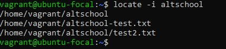
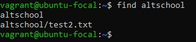
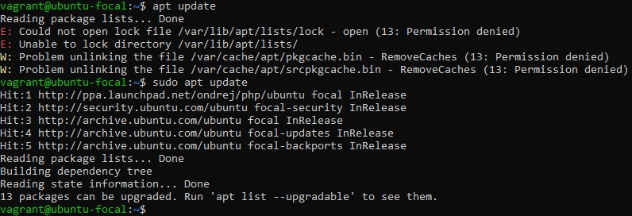
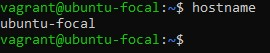
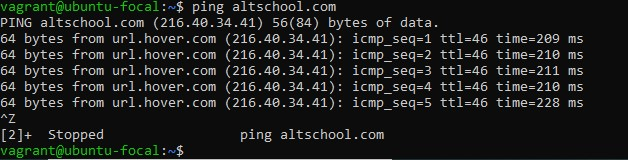
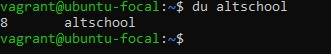
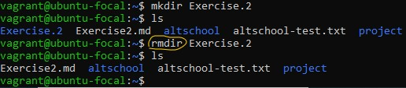
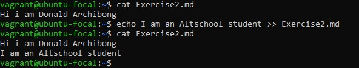
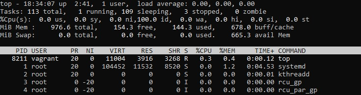

    ## The following are ten(10) Linux commands and their uses:

    ## 1. Locate -i 'filename':
        The locate command is used to find files on Linux systems. This command is useful when you don't know where the file is stored or the actual name of the file. If used with the -i argument, it becomes case-insensitive. So if you're looking for files that contain the word "altschool", typing "locate -i altschool" will give you a list of all files in your Linux system that contain the word "altschool".

    ## 2. Find:
        The 'find' command is similar to the 'locate' command but this only searches within a directory and not the general linux system. See illustration before.

    ## 3. Sudo:
        A common command on the Linux command line, sudo stands for "SuperUser Do". Therefore, if you want to run commands with administrator or root privileges, you can use the sudo command. For example, if you want to update your outdated packages, which needs root permissions, you can use the command – sudo apt update. You can enter the root command line using the command “sudo apt update”. If you use just 'apt update' linux will deny your command because you are not a super user. See illustration below.

    ## 4. Hostname:
        If you want to know the name of your host/network simply type hostname. Adding a -i to the end will display the IP address of your network.

    ## 5. Ping:
       Use the ping command to test your connectivity status to a server. For example, by entering ping altschool.com, the command will test whether or not you can connect with Altschool and it also measures the response time. See illustration below:

    ## 6. Cat:
       We use the 'cat' command to display the contents of a file. It is usually used to easily view programs. In the image below, using cat with a markdown file displayed the contents of the file.

    ## 7. Du :
        We use 'du' to know the disk usage of a file in your system. For example, if you want to know the disk space used by a folder named 'altschool', you can use the command “du altschool”.

    ## 8. Rmdir:
        If you need to remove a directory, use the rmdir command. However, rmdir can only remove empty directories.

    ## 9. Echo: 
        This command is used to move some data into a file. For example, if you want to add the text, “I am an Altschool student” into a file called Exercise2.md, you would type echo Hello, I am an Altschool student >> Exercise2.md.

    ## 10. Top:
       The top command displays a list of running processes and how much CPU each process uses. Below is an illustration.

