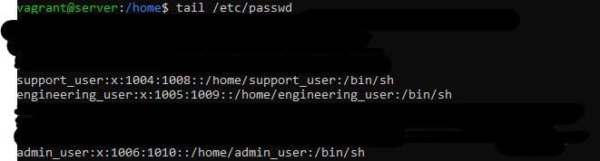

1. Below is the content of "/etc/passwd" when passed.

2. Below is the content of "/etc/group" when passed.
N.B: The content was too long for a screenshot so I used 'tail' command to only get the bottom.

3. Below is the content of "/etc/sudoers" when passed.
