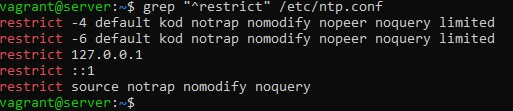

1. Ensure mounting of cramfs filesystems is disabled 
This is used to ensure that mounting of cramfs filesystems is disabled. We are disabling it because we do not need to keep a filesystem that isn't in use because that would increase local attack surface.

2. Ensure mounting of freevxfs filesystems is disabled
We use this to ensure that mounting of freevxfs filesystems is disabled. We are disabling it because we do not need to keep a filesystem that isn't in use because that would increase local attack surface.

3. Ensure package manager repositories are configured
This is to have package manager repositories configured to ensure they receive the latest patches amd updates. To verify that package repositories are configured well we;

4. Ensure GPG keys are configured
Most packages managers implement GPG key sugning to verify package integrity during installation. To verify that GPG keys are configured correctly for your package manager we call "apt-key list"

5. Ensure AIDE is installed
AIDE takes a snapshot of the filesystem's state, including file hashes, permissions, and modification timings, which can be compared to the current state of the filesystem to identify system changes. By keeping track of the filesystem status, it is possible to identify corrupted files and prevent or restrict the exposure of malicious or unintentional misconfigurations or altered binaries. To verify that AIDE is installed we call "dpkg -s aide".

6. Ensure time synchronization is in use
System time should be synchronized between all systems in an environment.Time synchronization is important to support time sensitive security mechanisms like 
Kerberos and also ensures log files have consistent time records across the enterprise, 
which aids in forensic investigations. To verify that NTP is installed we call "dpkg -s ntp"

7. Ensure ntp is configured
ntp is a daemon which implements the Network Time Protocol (NTP). It is designed to 
synchronize system clocks across a variety of systems and use a source that is highly 
accurate. If ntp is in use on the system proper configuration is vital to ensuring time synchronization 
is working properly.

8. Ensure SNMP Server is not enabled
The Simple Network Management Protocol (SNMP) server is used to listen for SNMP 
commands from an SNMP management system, execute the commands or collect the 
information and then send results back to the requesting system. The SNMP server can communicate using SNMP v1, which transmits data in the clear and 
does not require authentication to execute commands. Unless absolutely necessary, it is 
recommended that the SNMP service not be used. If SNMP is required the server should be 
configured to disallow SNMP v1. To disable snmpd we call "systemctl disable snmpd"

9. Ensure mail transfer agent is configured for local-only mode
Mail Transfer Agents (MTA), such as sendmail and Postfix, are used to listen for incoming 
mail and transfer the messages to the appropriate user or mail server. If the system is not 
intended to be a mail server, it is recommended that the MTA be configured to only process 
local mail. We run the following command to verify that the MTA is not listening on any non-loopback 
address "ss -lntu | grep -E ':25\s' | grep -E -v '\s(127.0.0.1|::1):25\s'"

10. Ensure mounting of hfs filesystems is disabled 
The hfs filesystem type is a hierarchical filesystem that allows you to mount Mac OS 
filesystems. Removing support for unneeded filesystem types reduces the local attack surface of the 
system. If this filesystem type is not needed, disable it.

